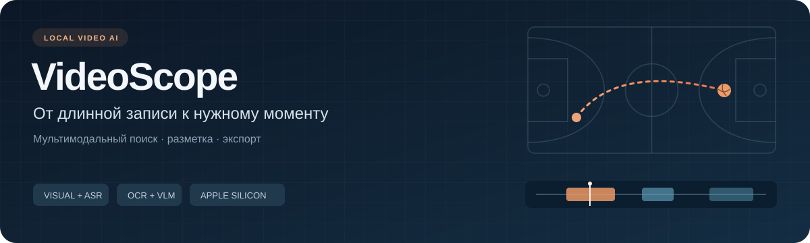
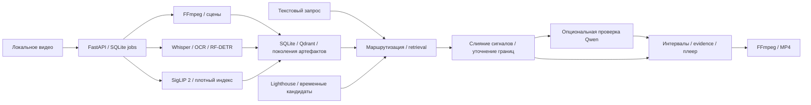

<p align="center">
  
</p>

<p align="center">
  
  
  
  <a href="LICENSE"></a>
</p>

<p align="center">
  <a href="#возможности">Возможности</a> ·
  <a href="#архитектура">Архитектура</a> ·
  <a href="#быстрый-запуск">Запуск</a> ·
  <a href="docs/guide.md">Руководство</a> ·
  <a href="#статус-и-оценка">Статус и оценка</a>
</p>

**VideoScope — локальное приложение для поиска моментов в видео на естественном языке и сборки MP4-нарезок.** Оно объединяет визуальные эмбеддинги, речь, текст на экране и объекты, ранжирует временные интервалы и показывает, какие наблюдения поддерживают каждый результат.

Баскетбольные матчи — первый предметный сценарий: длинная запись, короткие события, повторы и похожие действия. Общий поиск также рассчитан на интервью, лекции и другие пользовательские видео. Баскетбольный профиль дополняет общий конвейер и может быть отключён.

```text
Видео → индексация → текстовый запрос → эпизоды с evidence → просмотр → MP4
```

## Баскетбол как прикладной сценарий

1. Загрузить запись матча и дождаться обработки доступных сигналов.
2. Ввести запрос, например «игрок выполняет штрафной бросок» или «трёхочковый бросок».
3. Просмотреть предложенные эпизоды, их временные границы и подтверждающие наблюдения.
4. Скорректировать границы, добавить моменты в очередь и экспортировать нарезку.

Спортивная карточка разделяет предположение о событии и наблюдаемые факты. Номер игрока не становится подтверждённым только потому, что его назвала VLM. Качество спортивного поиска остаётся экспериментальным; система помогает найти и проверить кандидатов.

## Возможности

| Направление | Реализация |
|---|---|
| **Мультимодальный поиск** | Whisper для речи, PaddleOCR для текста, RF-DETR для объектов, SigLIP 2 для кадров, MPNet + Qdrant для семантического поиска. |
| **Поиск по времени** | Плотный визуальный индекс всей записи, отдельное уточнение границ, Lighthouse QD-DETR как дополнительный retriever временных интервалов. |
| **Проверка кандидатов** | Локальная Qwen3.5 9B через MLX проверяет короткие видеофрагменты; результаты сохраняют исходные evidence и запасной путь поиска. |
| **Работа с видео** | Библиотека, плеер с переходом к таймкоду, очередь фрагментов, ручная правка границ и FFmpeg-экспорт MP4. |
| **Надёжная индексация** | Сохраняемая очередь SQLite: прогресс, отмена, повтор, восстановление после перезапуска. Новые поколения индексов активируются атомарно. |
| **Разметка матчей** | Отдельное локальное рабочее место: события и владения, команды и игроки, точки на кадрах, черновики, история правок, разрешение конфликтов и backup/restore. |
| **Воспроизводимая оценка** | Закреплённые данные, модели и runtime; сравнение поисковых профилей по качеству, задержке и памяти; отдельный учёт ошибок инфраструктуры. |

### Рабочее место разметки

Редактор открывает полную запись и позволяет продолжить с сохранённого места. События можно связать с владениями и участниками; пространственные наблюдения хранятся с исходным кадром и временем. Несколько вкладок согласуют конфликтующие версии явно, а резервная копия сохраняет историю и происхождение записей.

Инструмент работает отдельно от ML-инференса. Человеческие ответы поступают в annotation inbox: они не запускают обучение и не становятся автоматически gold-разметкой. Подготовка источников, разрешённые роли и команды запуска описаны в [руководстве по разметке](docs/benchmarks/phase1/workbench/README.md).

## Архитектура



**Модели изолированы от API.** Vision, Whisper, OCR, Qwen и Lighthouse используют отдельные окружения. Локальный inference рассчитан на Apple Silicon; тяжёлые компоненты подключаются явно.

**Индексы имеют проверяемую идентичность.** Source hash, модель, preprocessing и схема входят в описание поколения. Незавершённый индекс не заменяет рабочий; откат сохраняет исходное видео и предыдущее состояние поиска.

**Данные остаются локально по умолчанию.** Сервисы слушают loopback, индексы и пользовательская разметка исключены из Git. Опциональные внешние Roboflow/InternVideo-интеграции требуют отдельной настройки; автоматического перехода в облако нет.

Подробности: [архитектура](docs/architecture.md) · [контракты данных](docs/data-contracts.md) · [поколения и восстановление](docs/system-rebuild.md).

## Быстрый запуск

Для локальных ML-workers: **macOS 14+ и Apple Silicon**. Нужны `uv==0.12.3`, Node.js 22, pnpm 11, FFmpeg и FFprobe. Закреплённые Python-окружения создаются скриптами проекта: 3.12.13 для основного стека и 3.11.14 для Lighthouse.

```bash
git clone https://github.com/guguker/VideoScope.git
cd VideoScope
make install
cp .env.example .env
make dev
```

Открыть [интерфейс](http://127.0.0.1:5173) или [OpenAPI](http://127.0.0.1:8765/api/docs). Базовый запуск не загружает все модели: состав поиска зависит от установленных и настроенных провайдеров. Пользовательские файлы хранятся в `data/`.

Модели загружаются отдельными командами. Для подключения визуального и речевого поиска:

```bash
make models-base
make install-vision models-vision
make install-whisper models-whisper
```

Затем задать локальные endpoint/token-пары из `.env.example`, запустить `make vision-worker` и `make whisper-worker` в отдельных терминалах и перезапустить приложение. Установка OCR, Qwen, Lighthouse и переиндексация существующей библиотеки описаны в [полном руководстве](docs/guide.md).

### Опциональная утилита загрузки

[YouTube Downloader для macOS](scripts/youtube-downloader/README.md) — отдельное нативное окно на Swift с очередью, выбором формата, прогрессом и отменой. Запуск: `download-youtube.command`. Оно сохраняет файлы в локальную папку `Данные матчи`, не индексирует их и не использует для обучения. Cookies читаются только при явном выборе соответствующей опции.

## Статус и оценка

Проект находится в активной разработке. Реализованы общий поиск, экспорт, надёжная индексация и рабочее место разметки полных матчей. Собственное обучение и fine-tuning моделей ещё не выполнялись; используются готовые pretrained-модели.

| Проверенный этап | Что подтверждено |
|---|---|
| **Phase 0 / 6 сентября 2026** | Пять поисковых конфигураций, шесть offline-attested окружений, полный smoke на M4 Pro / 24 ГБ, экспорт MP4 и принудительный rollback. [Evidence bundle](docs/benchmarks/phase0/accepted/7054f13/README.md). |
| **Phase 1 / разметка** | Исходники и проверки редактора полных матчей: события, участники, пространственные наблюдения, сохранение и восстановление. [Контракт и статус проверки](docs/benchmarks/phase1/workbench/README.md). |
| **Следующий ML-этап** | Независимые данные и разметка, разделение по целым источникам, замороженная оценка; затем небольшой обучаемый temporal ranker. [План](docs/ml-autonomy-plan.md). |

**Ограничения качества остаются открытыми.** Принятый baseline использует 10 подготовленных клипов, 5 поисковых кейсов и 2 группы исходных видео; это уже изученный regression-набор. Direct verifier дал 3 совпадения из 10, в отчёте сохранены нарушения quality guardrails. Эти результаты подтверждают работу измерительного контура, но не обобщение на независимых видео. InternVideo присутствует как опциональный адаптер и не был настроен в этом baseline.

Qwen может ошибаться в типе события и номере игрока. Baseline не подтверждает промышленное качество или готовую баскетбольную аналитику. Разметочный инструмент и завершённый обучающий датасет — разные этапы.

## Проверка и документация

```bash
make test       # backend + frontend
make build      # TypeScript + Vite
```

Проверки редактора на синтетических данных, без моделей и пользовательских видео:

```bash
PYTHONPATH=backend/src .venv/bin/pytest backend/tests/test_annotation_workbench_*.py
node scripts/smoke-annotation-workbench.mjs
```

Полный ML-smoke требует заранее подготовленных моделей, окружений и отдельных временных каталогов. Он запускается отдельно по [инструкции аттестации](docs/ml-environment-attestation.md).

- [Установка, провайдеры и эксплуатация](docs/guide.md)
- [Benchmark core и методология](docs/benchmark-core.md)
- [Локальная модельная стратегия](docs/local-model-strategy.md)
- [Разметка полных матчей](docs/benchmarks/phase1/workbench/README.md)
- [Исторические снимки интерфейса](docs/evidence/README.md)
- [Зависимости и совместимость](docs/dependencies.md)

Код распространяется под [MIT](LICENSE). Модели и исходные видео имеют собственные условия использования; их веса и пользовательские данные в репозиторий не входят.
