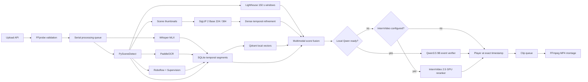

# VideoScope architecture

## Runtime pipeline

## Data model

The source video is stored once. Persisted indexing observations are represented
as temporal segments:

- `video_id`
- `start`, `end`
- `modality`: `scene`, `speech`, `ocr`, or `objects`
- `text` or label payload
- confidence and provider metadata
- representative thumbnail

Qdrant stores vectors and lightweight payloads. SigLIP and Lighthouse keep
rebuildable, versioned per-video artifacts outside SQLite. Their query-time
`visual`/`lighthouse` evidence and Qwen/InternVideo judgements are returned in the
search response, but are not accepted as persistent segment modalities. SQLite
remains the source of truth for video metadata, processing state, and persisted
temporal evidence.

## Ranking

1. The query router chooses speech, OCR, object, visual, or mixed retrieval and assigns modality weights.
2. Qdrant retrieves semantic text, OCR, and object evidence; SQLite adds exact, inflected, transliterated, and phonetic matches.
3. SigLIP 2 retrieves scenes and densely refines the two best visual intervals.
4. Lighthouse windows are retained only when corroborated by visual or object evidence.
5. Scores are calibrated within each modality and temporally overlapping hits are clustered per video.
6. A ready local Qwen3.5 9B model verifies only the best fused short-event candidates.
7. If Qwen is unavailable, a configured InternVideo 2.5 endpoint can rerank the best candidates; otherwise the fused result is returned without a heavy reranker.

This makes the final score explainable: the API returns the evidence and modality list for every result.
For sports events it also returns a strict allowlist of structured observations: the event type,
chronological stage scores and independently checked Qwen facts. The client renders them as an
event card and labels a detected jersey number as unconfirmed until another signal corroborates it.
Internal paths, prompt versions and provider secrets are never included in this payload.

## Sports profile

The basketball profile is a query-time specialization, not a separate indexing pipeline. SigLIP 2 forms chronological candidates such as `release → ball near rim → reaction`; Qwen checks observable facts on a short clip or storyboard. Qwen does not independently establish the shot type or player number. Those conclusions require agreement with temporal, OCR, object, or tracking evidence.

Any future learned fusion layer (for example, gradient-boosted trees over these observations) must
be trained and evaluated on different complete matches. Windows from one match must not be split
between training and test sets. A saved evaluation report is treated as stale when
the control set, metric methodology, schema, active model/provider stack, glossary
or retrieval configuration no longer matches the current runtime.

## Failure isolation

FFmpeg probing is critical. Speech, OCR, Roboflow, Lighthouse, dense refinement, Qwen, and InternVideo are isolated optional stages. A failed optional stage is saved as a warning or logged at query time, while completed evidence remains searchable.

## Security boundary

- The primary server accepts only loopback bind addresses and rejects untrusted
  `Host` headers; state-changing browser requests also require a trusted `Origin`.
- Upload names are normalized and never used as storage paths.
- Upload requests are bounded at the ASGI `receive` boundary before multipart
  parsing, including bodies with a missing or false `Content-Length`; the route
  then accepts exactly one file and enforces the media-size limit again while
  copying it into application storage.
- FFmpeg is always invoked with argument arrays, never through a shell.
- SQLite writes use parameters.
- Public request models reject unknown fields, unsafe video IDs, non-finite values
  and inverted intervals.
- Media, thumbnail, and export routes resolve symlinks and verify containment in
  their dedicated directories.
- Local RF-DETR processes frames on the VideoScope machine. Only the optional Roboflow Serverless path receives frames, and only after both an API key and a non-local model ID are explicitly configured.
- Qwen runs locally through MLX. A configured external InternVideo endpoint receives only selected downscaled frames from the best fused candidates, never the complete source video.
