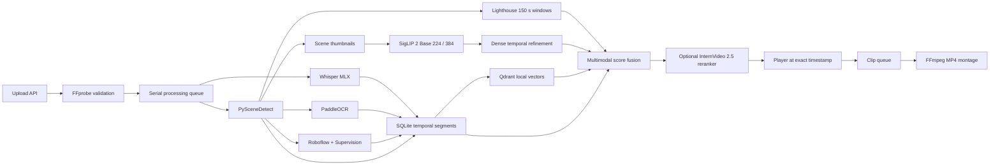

# VideoScope architecture

## Runtime pipeline

## Data model

The source video is stored once. Every observation is represented as a temporal segment:

- `video_id`
- `start`, `end`
- `modality`: `scene`, `speech`, `ocr`, `objects`, `visual`, `lighthouse`, `internvideo`
- `text` or label payload
- confidence and provider metadata
- representative thumbnail

Qdrant stores vectors and lightweight payloads. SQLite remains the source of truth for video metadata, processing state, and temporal evidence.

## Ranking

1. The query router chooses speech, OCR, object, visual, or mixed retrieval and assigns modality weights.
2. Qdrant retrieves semantic text, OCR, and object evidence; SQLite adds exact, inflected, transliterated, and phonetic matches.
3. SigLIP 2 retrieves scenes and densely refines the two best visual intervals.
4. Lighthouse windows are retained only when corroborated by visual or object evidence.
5. Scores are calibrated within each modality and temporally overlapping hits are clustered per video.
6. A configured InternVideo 2.5 endpoint reranks only the best fused candidates.

This makes the final score explainable: the API returns the evidence and modality list for every result.

## Failure isolation

FFmpeg probing is critical. Speech, OCR, Roboflow, Lighthouse, dense refinement, and InternVideo are isolated optional stages. A failed optional stage is saved as a warning or logged at query time, while completed evidence remains searchable.

## Security boundary

- Upload names are normalized and never used as storage paths.
- File size is enforced while streaming.
- FFmpeg is always invoked with argument arrays, never through a shell.
- SQLite writes use parameters.
- Media, thumbnail, and export routes verify resolved parent directories.
- Roboflow receives frames only after both an API key and model ID are explicitly configured.
