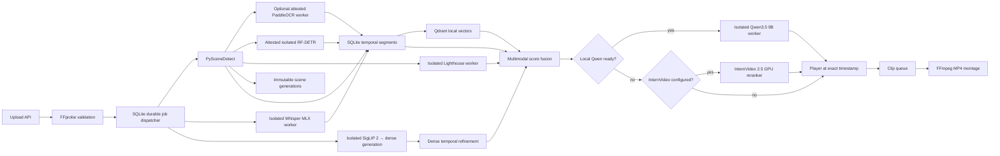

# VideoScope architecture

## Runtime pipeline

## Data model

The source video is stored once. Persisted indexing observations are represented
as temporal segments:

- `video_id`
- `start`, `end`
- `modality`: `scene`, `speech`, `ocr`, or `objects`
- `text` or label payload
- confidence and provider metadata
- representative thumbnail

Qdrant stores vectors and identity-only payloads in immutable per-video
generations; SQLite owns the active-generation pointer and upstream lineage.
SigLIP and Lighthouse keep immutable, versioned per-video artifacts outside
SQLite, while SQLite stores the exact descriptors and owns the active release.
Their query-time
`visual`/`lighthouse` evidence and Qwen/InternVideo judgements are returned in the
search response, but are not accepted as persistent segment modalities. SQLite
remains the source of truth for video metadata, processing state, and persisted
temporal evidence.

The API acquires an exclusive lock for `data/` before SQLite initialization,
recovery or provider construction. Offline visual and Lighthouse maintenance use
the same ownership boundary. Within one runtime, Indexer and GC share a
`TextVectorStorageGate`, and a single lazy embedded-Qdrant client is reused.
Shutdown stops new claims but preserves queued rows. If the current ML operation
is still running, a reaper retains Qdrant and the data lock until the dispatcher
and GC actually stop. Startup first recovers artifact builds, then terminalizes
an abandoned RUNNING job and creates an exact-plan retry child before starting
new workers.

## Ranking

1. The query router chooses speech, OCR, object, visual, or mixed retrieval and assigns modality weights.
2. Qdrant reads only the generation selected and validated by SQLite, retrieves
   semantic speech, OCR, and object evidence, then hydrates authoritative text
   and metadata from SQLite. SQLite also adds exact, inflected, transliterated,
   and phonetic matches.
3. SigLIP 2 retrieves across a dense, specification-versioned timeline for each
   video; incomplete, corrupt, or specification-incompatible generations fail
   closed. The source digest is recorded, and mutation during generation build
   aborts activation.
4. The isolated Lighthouse worker searches only validated immutable feature
   generations; its windows are retained only when corroborated by visual or
   object evidence.
5. Scores are calibrated within each modality and temporally overlapping hits are clustered per video.
6. A ready local Qwen3.5 9B worker verifies only the best fused short-event
   candidates; in the target worker configuration MLX-VLM does not import into
   the backend process. A deprecated in-process opt-in exists only for rollback
   diagnostics.
7. If Qwen is unavailable, a configured InternVideo 2.5 endpoint can rerank the best candidates; otherwise the fused result is returned without a heavy reranker.

Reranking preserves the original proposal independently of its output interval.
The service binds detached candidates before calling a reranker and verifies
one-to-one membership, source video, source evidence and modality tags afterward.
Qwen may refine a confirmed generic event only within its previously inspected
source context, with matching verification evidence. Temporary proposal tokens
never enter views or persisted receipts. Provider mutation or failure leaves the
original fused candidates and the untouched tail available to local fallback.

This makes the final score explainable: the API returns the evidence and modality list for every result.
For sports events it also returns a strict allowlist of structured observations: the event type,
chronological stage scores and independently checked Qwen facts. The client renders them as an
event card and labels a detected jersey number as unconfirmed until another signal corroborates it.
Internal paths, prompt versions and provider secrets are never included in this payload.

## Sports profile

The basketball profile is a query-time specialization, not a separate indexing pipeline. SigLIP 2 forms chronological candidates such as `release → ball near rim → reaction`; Qwen checks observable facts on a short clip or storyboard. Qwen does not independently establish the shot type or player number. Those conclusions require agreement with temporal, OCR, object, or tracking evidence.

Any future learned fusion layer (for example, gradient-boosted trees over these observations) must
be trained and evaluated on different complete matches. Windows from one match must not be split
between training and test sets. A saved evaluation report is treated as stale when
the control set, metric methodology, schema, active model/provider stack, glossary
or retrieval configuration no longer matches the current runtime.

## Failure isolation

FFmpeg probing is critical, while optional failures are isolated. SQLite segment
stages record explicit failed/not-configured runs and preserve compatible active
generations; text-vector, dense visual and Lighthouse activation preserve their
previous pointers. Dense and Lighthouse failures become video warnings, while
Qwen and InternVideo failures are logged at query time.

Every upload/reindex is a durable `video_index` job. The upload record, immutable
Asset identity, persisted canonical plan and QUEUED job are committed together;
reindex snapshots the prior video projection in one transaction. A RUNNING job
owns a fresh secret execution token, and every linked stage/build mutation is
fenced by that token. Job-owned segment, vector, SigLIP and Lighthouse outputs
remain inactive while the job runs. Only `complete_video_index_job` publishes one
coherent SQLite release; cancellation, failure or crash recovery therefore leave
the previous release selected. Completion also requires exactly one terminal,
plan-matching receipt for each of the seven stages; a missing optional provider
is recorded explicitly instead of disappearing from history. Provider
`active.json` files are legacy caches, not authority for job-backed search.

Text-vector recovery is leased and fenced. Temporary Qdrant failures remain
retryable with capped backoff, permanent contract violations fail closed, and
corrupt recovery metadata is quarantined without becoming a deletion target.
Committed generations are never eligible for GC, and exact deletion is verified
before a job completes.

## Security boundary

- The primary server accepts only loopback bind addresses and rejects untrusted
  `Host` headers; state-changing browser requests also require a trusted `Origin`.
- Upload names are normalized and never used as storage paths.
- Upload requests are bounded at the ASGI `receive` boundary before multipart
  parsing, including bodies with a missing or false `Content-Length`; the route
  then accepts exactly one file and enforces the media-size limit again while
  copying it into application storage.
- FFmpeg is always invoked with argument arrays, never through a shell.
- Durable indexing uses content-attested FFmpeg/FFprobe paths with an empty
  subprocess environment and binds their bytes/version output, the reviewed
  Python lock, required distributions, and exact Python runtime platform into
  the persisted executor identity. Drift is checked before release activation.
- SQLite writes use parameters.
- Public request models reject unknown fields, unsafe video IDs, non-finite values
  and inverted intervals.
- Media, thumbnail, and export routes resolve symlinks and verify containment in
  their dedicated directories.
- Local RF-DETR processes frames on the VideoScope machine. The legacy
  Roboflow Serverless adapter can receive selected frames only after both an API
  key and a non-local model ID are explicitly configured; durable jobs reject
  that mutable cloud boundary and require the attested isolated worker.
- SigLIP and local RF-DETR run in one authenticated loopback-only vision worker
  with a dedicated hashed environment and an identity-bound MPS/float32 compute
  contract. Only one vision backbone is resident at a time, and durable and
  legacy indexing explicitly release RF-DETR at the object-stage boundary. It
  accepts only bounded immutable image snapshots from allowlisted `data/`
  subdirectories; see
  `docs/vision-worker.md`.
- MLX Whisper runs in a separate authenticated loopback-only worker. A single
  bounded prompt/glossary snapshot is shared by the stage identity and request,
  media inference uses a private verified copy, and the pinned request-level
  model cache is cleared after every outcome; see
  `docs/whisper-worker.md`.
- OCR children are scoped to the ingestion stage and must exit before its
  generation is published. Retirement failure aborts the job and retains the
  previous release; Runtime shutdown also closes its owned OCR reader before
  releasing storage ownership. See
  `docs/benchmarks/phase0/ocr-lifecycle-control.md`.
- Qwen runs locally through MLX in an authenticated loopback-only worker with a
  dedicated locked environment. The backend shares only one-use files under
  `data/tmp`, never arbitrary library paths.
- Lighthouse runs in its own pinned Python 3.11 environment behind an
  authenticated loopback-only endpoint. It accepts only contained media paths
  and publishes bounded, validated immutable feature snapshots; see
  `docs/lighthouse-worker.md`.
- A configured external InternVideo
  endpoint receives only selected downscaled frames from the best fused
  candidates, never the complete source video.
