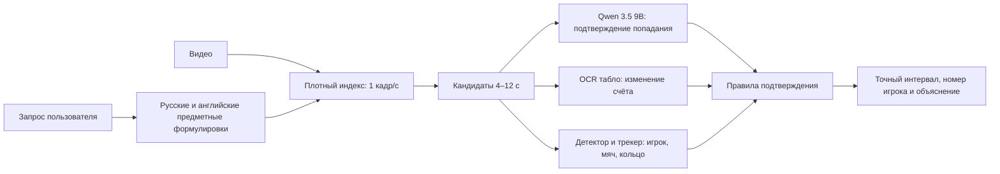

# Улучшение поиска баскетбольных событий

## Зафиксированная проблема

Исходная версия сопоставляла запрос с одним центральным кадром каждой сцены. Для матча
длительностью 6992.9 с в индексе было только 514 кадров: в среднем один кадр каждые
13.6 с. Такое представление не содержит движение и не позволяет отличить попадание от
промаха, штрафного броска, передачи или рекламной заставки.

Ручная проверка исходной версии:

| Запрос | Полезных результатов в top-10 | Precision@10 |
|---|---:|---:|
| `игрок забивает трехочковый` | 0 | 0.00 |
| `basketball player makes a three-point shot` | 1 | 0.10 |

Английский запрос находил ещё одно событие рядом, но возвращаемый интервал завершался
до выпуска мяча и потому не был пригоден пользователю.

## Эталонные события

| Событие | Интервал | Проверяемые признаки |
|---|---|---|
| Синий №15 забивает трёхочковый | 00:31:03.5–00:31:08.5 | подготовка, выпуск из-за дуги, мяч в кольце, смена владения |
| Белый №9 забивает трёхочковый | 01:54:24.4–01:54:28.8 | подготовка, выпуск, попадание, реакция с поднятыми тремя пальцами |
| Штрафной бросок | около 01:46:42 | сложный отрицательный пример |
| Рекламная заставка | около 00:29:54 | явный отрицательный пример |

Разделение выборки выполняется по матчам, а не по перекрывающимся окнам одного видео.
Иначе соседние кадры одного события одновременно попадут в обучение и проверку и
создадут завышенную оценку качества.

## Новая схема

Один общий similarity больше не считается доказательством события. Для запроса о
забитом трёхочковом обязательны два независимых признака:

1. `made = true` — Qwen подтверждает нисходящее прохождение мяча через кольцо либо
   находится независимое изменение счёта;
2. `three_point = true` — плотный временной поиск находит последовательность
   «дальний выпуск → мяч у кольца → пост-бросковая реакция», а в следующем предметном
   слое это дополнительно проверяется геометрией площадки или изменением счёта на три
   очка.

Если один из признаков отсутствует, результат остаётся кандидатом и не получает статус
подтверждённого.

## Выбор локальной модели

Основной проверяющий модуль — `Qwen3.5-9B-MLX-4bit`. Модель нативно мультимодальная,
имеет локальную MLX-квантизацию около 5.95 ГБ и помещается на MacBook Pro M4 Pro с
24 ГБ общей памяти. Она вызывается только для лучших кандидатов, а не для каждого
кадра двухчасового файла.

`Qwen3-VL-2B` проверена как быстрый резерв: модель читает номер 15 и видит мяч в
кольце, но нестабильно определяет положение игрока относительно трёхочковой дуги.
Поэтому 2B не используется как источник окончательного решения.

`Gemma 3 12B` также можно запустить локально, но её MLX-квантизация больше, лицензия
менее удобна для проекта, а открытый интерфейс ориентирован прежде всего на
последовательности изображений. Она остаётся резервным вариантом для контрольного
сравнения, если Qwen 3.5 не пройдёт предметные тесты.

## Проверка моделей на реальных сценах

Количество параметров не использовалось как показатель качества само по себе. Все
варианты проверялись на одних и тех же четырёх сценах: два размеченных попадания,
штрафной и рекламная вставка.

| Вариант | События | Номера | Вывод |
|---|---:|---:|---|
| Qwen3-VL 2B, раскадровка | нестабильно | №15 читается | недостаточно для положения за дугой |
| Qwen3.5 9B, строгий JSON по раскадровке | 2/4 | 0/2 | отвергла оба настоящих попадания |
| Qwen3.5 9B, строгий JSON по видео | 0/2 положительных | 0/2 | монолитный запрос ломает структурированный ответ |
| Qwen3.5 9B, независимые факты по видео | попадание 3/3 | №9 верно, №15 ошибочно | хорошо видит мяч в кольце, но считает штрафной броском из-за дуги |

Последний тест занял около 23–24 с на семисекундный клип. Пиковое потребление общей
памяти составило около 10–12 ГБ, swap не использовался. Следовательно, MacBook
действительно способен запустить 9B-модель; ограничение связано не с объёмом памяти,
а с качеством постановки задачи и отсутствием явной геометрии площадки.

Поэтому Qwen не получает право самостоятельно решать, был ли бросок трёхочковым.
Она используется как проверка попадания и мягкий источник возможного номера. Тип
броска подтверждается отдельным временным сигналом, а номер считается достоверным
только после согласования по нескольким кадрам.

## Реализованные изменения

- добавлены англоязычные баскетбольные формулировки для русских запросов;
- визуальный индекс строится равномерно с шагом 1 с вместо одного кадра на сцену;
- временное уточнение расширено с 2 до 12 кандидатов, шаг уменьшен с 1.5 до 0.75 с;
- добавлена локальная проверка Qwen по раскадровке из 12 последовательных кадров;
- для баскетбольного запроса кадры объединяются в хронологические стадии
  «выпуск → кольцо → реакция», а не ранжируются независимо;
- короткие исходные интервалы расширяются контекстом до проверки;
- номер бросающего сохраняется в доказательстве результата;
- противоречивый ответ модели не может подтвердить забитый трёхочковый;
- сходство SigLIP больше не превращается в искусственную уверенность около 1.0;
- action-запросы могут использовать комментарий матча и OCR табло как дополнительные
  источники.

## Текущее подтверждённое состояние

На длинной записи `01:56:32` построено 6993 равномерных кадра SigLIP 2; вместе с
остальными видео в локальном индексе находится 8780 визуальных векторов.

- среди первых шести результатов запроса о трёхочковом четыре эпизода проверены как
  полезные: `Precision@6 = 0.667`;
- для двух размеченных двухочковых и двух штрафных оба эталона вошли в первые
  20 кандидатов: `Recall@20 = 1.00` для каждого типа;
- реализованные штрафные заняли 1-е и 9-е места, а два размеченных промаха не вошли
  в первые 100 результатов;
- два размеченных трёхочковых находятся на позициях 6 и 18, поэтому требование
  «оба события в top-10» пока не выполнено;
- первое обогащение 12 кандидатов Qwen заняло 545.7 с, повторный запрос после
  сохранения проверок — 4.24 с, то есть примерно в 129 раз быстрее.

Спортивный профиль остаётся экспериментальным. Эти результаты подтверждают
работоспособность поиска кандидатов, но не дают Qwen права самостоятельно определять
тип броска или номер игрока.

## Следующий предметный слой

Для устойчивого распознавания игроков и попаданий одной большой VLM недостаточно.
Следующая версия должна добавить:

- OCR фиксированной области табло с частотой 2–5 кадров/с и временным голосованием;
- RF-DETR, дообученный на классах `player`, `ball`, `rim`, `backboard`;
- ByteTrack для игроков и OC-SORT для маленького быстро движущегося мяча;
- память наблюдений `track_id → команда → номер → интервалы`;
- подтверждение попадания по переходу мяча сверху вниз через область кольца;
- для роликов без табло — калибровку площадки и положение стоп бросающего относительно
  дуги.

## Критерии выпуска

Изменение модели принимается только при выполнении всех условий:

- оба эталонных попадания находятся в top-10;
- штрафной и реклама не получают статус подтверждённого трёхочкового;
- `Precision@5 ≥ 0.60`, `Recall@20 ≥ 0.80` на размеченных матчах;
- средняя ошибка границ события не превышает 1 с;
- номер игрока выводится только при устойчивом чтении на нескольких кадрах;
- интерфейс показывает «недостаточно данных», если доказательства противоречат друг
  другу.

## Использованные источники

- Qwen Team. [Qwen3.5: документация мультимодальной модели](https://huggingface.co/docs/transformers/model_doc/qwen3_5).
- MLX Community. [Qwen3.5 9B, квантизация MLX 4 bit](https://huggingface.co/mlx-community/Qwen3.5-9B-MLX-4bit).
- Blaizzy. [MLX-VLM — локальный вывод VLM на Apple Silicon](https://github.com/Blaizzy/mlx-vlm).
- Google DeepMind. [Gemma 3](https://deepmind.google/models/gemma/gemma-3/).
- Roboflow. [RF-DETR](https://github.com/roboflow/rf-detr).
- Zhang et al. [ByteTrack](https://github.com/FoundationVision/ByteTrack).
- Cao et al. [OC-SORT](https://github.com/noahcao/OC_SORT).
- PaddlePaddle. [PaddleOCR](https://github.com/PaddlePaddle/PaddleOCR).
